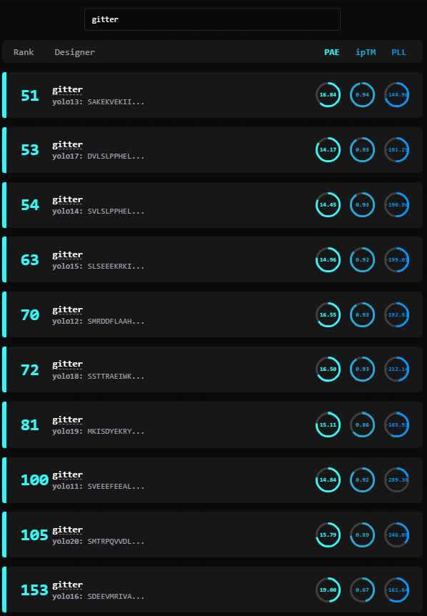

# Adaptyv EGFR protein design competition round 2

## Building BindCraft
I built the Apptainer container with an interactive CHTC job following their [instructions](https://chtc.cs.wisc.edu/uw-research-computing/apptainer-htc) and the submit file `build_bindcraft.sub`.
This was submitted with `condor_submit -i build_bindcraft.sub`.

Within the interactive job, I ran
```
chmod 1777 /tmp
apptainer build bindcraft.sif bindcraft.def
mv bindcraft.sif /staging/agitter
```
`chmod` was needed to address errors related to [temporary files](https://superuser.com/questions/1496529/sudo-apt-get-update-couldnt-create-temporary-file) encountered during the container build (see below).

The container does not include the actual BindCraft source code, so that was downloaded separately and transferred to jobs.
BindCraft v1.1.0 was downloaded with
```
wget -O bindcraft-v1.1.0.tar.gz https://github.com/martinpacesa/BindCraft/archive/refs/tags/v1.1.0.tar.gz
```

## AlphaFold2 weights
The AlphaFold2 weights were downloaded and copied to [CHTC staging](https://chtc.cs.wisc.edu/uw-research-computing/file-avail-largedata.html)
```
curl -o params/alphafold_params_2022-12-06.tar https://storage.googleapis.com/alphafold/alphafold_params_2022-12-06.tar
cd params/
$ scp alphafold_params_2022-12-06.tar agitter@transfer.chtc.wisc.edu:/staging/agitter/
```

## EGFR settings
The structure (PDB [6ARU](https://www.rcsb.org/structure/6aru)) and interaction sites are those provided by [Adaptyv](https://design.adaptyvbio.com/).
A different HTCondor submission file `run_bindcraft_EGFR_<n>.sub` was used for each of the settings below with the same exectuable script `run_bindcraft_EGFR.sh`.
Environment variables controlled which BindCraft settings in the `EGFR` subdirectory were passed to the script.
1. Default BindCraft filters and advanced settings. All interaction sites from Adaptyv. Lengths 50 to 250.
2. Default BindCraft filters and advanced settings. Domain 3 structure without interaction sites. Lengths 60 to 120. Strategy from [@design_proteins](https://x.com/design_proteins/status/1851295516564525515) and structure from [@btnaughton](https://x.com/btnaughton/status/1851436952446537980).
3. Default BindCraft filters and advanced settings. Domain 3 structure without interaction sites. Lengths 50 to 75. Modifies strategy 2 with shorter lengths.
4. Default BindCraft filters. Modify advanced settings to increase `weights_pae_inter` and `weights_iptm` 4x. Domain 3 structure without interaction sites. Lengths 60 to 120.
5. Default BindCraft filters. Modify advanced settings to increase `weights_pae_inter` and `weights_iptm` 4x and `weights_helicity` to -1. Domain 3 structure without interaction sites. Lengths 60 to 120.
6. Default BindCraft filters and advanced settings. All interaction sites from Adaptyv. Lengths 50 to 200. Similar to setting 1 but reconfigured into a larger number of shorter jobs and shortened max length. Reduced iteractions to reduce runtime.
7. Default BindCraft filters. Modify advanced settings to increase `weights_pae_inter` and `weights_iptm` 4x. Domain 3 structure with interaction sites. Lengths 60 to 120.

## Analysis
The analysis code runs in the `adaptyv` conda environment created with `environment.yml`.
It was derived from the [METL](https://github.com/gitter-lab/metl/blob/9912989380ebe1246a2e35a92488e424d7ae571b/environment.yml) environment to be compatible with METL pretrained models and updated to add requirements for the Adaptyv `competition_metrics`.
After creating and activating the environment, `pip install metl-pretrained/` to install the local METL package.

## Submissions
### Submission 1
After the [announcement](https://x.com/adaptyvbio/status/1852435680506355823) that "You can also submit more than once but we will only count the last 10 designs for the leaderboard", I made an initial submission on 2024-11-01 before the full pipeline was finished to get initial feedback.
This submission collected all BindCraft designs with the ChatGPT 4o mini-suggested command
```
find . -type f -path './EGFR_output_*/*final_design_stats.csv' -exec cat {} + > round2_concatenated_final_design_stats_sub1.csv
```
That file was manually reviewed to:
- Prioritize Average_i_pTM
- Use Average_i_pAE and Average_pLDDT as secondary criteria
- Select sequences from unique seeds
- Select two sequences from runs with `weights_helicity` -1.0

The resulting 10 sequences are `round2-egfr-inhibitors-submission1-key.fasta` and an anonymized version is `round2-egfr-inhibitors-submission1.fasta` that strips the BindCraft design names.
On 2024-11-02, the results were  


### Submission 2
The second submission focused on short sequences. I generated `round2_concatenated_final_design_stats_sub1.csv` using the additional BindCraft runs that had finish and manually reviewed the file using the same criteria as before using the same criteria.
This time I required the general sequences to have length <= 60 and the non-helical sequences to have length <= 75 (none were <= 60).

## Third-party files
- `bindcraft.def`: Apptainer Definition file created by [@komatsuna-san](https://github.com/martinpacesa/BindCraft/issues/23#issuecomment-2408333526).
- `bindcraft-v1.1.0.tar.gz`: BindCraft [v1.1.0 release](https://github.com/martinpacesa/BindCraft/releases/tag/v1.1.0) archive. Available under the [MIT License](https://github.com/martinpacesa/BindCraft/blob/main/LICENSE).
- `PDL1_example`: BindCraft example files in this subdirectory are from its [GitHub repo](https://github.com/martinpacesa/BindCraft/tree/d2d3cd0b5d6b02d12d24afa59e640717e36f552c) (version 1.1.0). Available under the [MIT License](https://github.com/martinpacesa/BindCraft/blob/main/LICENSE).
- `6aru.pdb`: Structure of Cetuximab Fab mutant in complex with EGFR extracellular domain (PDB [6ARU](https://www.rcsb.org/structure/6aru))
- `6aru_final_chain_A_domain_3.pdb`: Domain 3 of EGFR structure [6ARU](https://www.rcsb.org/structure/6aru) from @btnaughton's [gist](https://gist.github.com/hgbrian/affd44dc63c6fb01a5a9620c24c74b26) as suggested by [@design_proteins](https://x.com/design_proteins/status/1851308130392473919).

## Apptainer build error
Errors encountered related to `/tmp` permissions during container build.
```
W: GPG error: https://developer.download.nvidia.com/compute/cuda/repos/ubuntu2204/x86_64  InRelease: Couldn't create temporary file /tmp/apt.conf.xCxAs0 for passing config to apt-key
E: The repository 'https://developer.download.nvidia.com/compute/cuda/repos/ubuntu2204/x86_64  InRelease' is not signed.
N: Updating from such a repository can't be done securely, and is therefore disabled by default.
N: See apt-secure(8) manpage for repository creation and user configuration details.
W: GPG error: http://archive.ubuntu.com/ubuntu jammy InRelease: Couldn't create temporary file /tmp/apt.conf.Y4sBpz for passing config to apt-key
E: The repository 'http://archive.ubuntu.com/ubuntu jammy InRelease' is not signed.
N: Updating from such a repository can't be done securely, and is therefore disabled by default.
N: See apt-secure(8) manpage for repository creation and user configuration details.
W: GPG error: http://security.ubuntu.com/ubuntu jammy-security InRelease: Couldn't create temporary file /tmp/apt.conf.Yowfdp for passing config to apt-key
E: The repository 'http://security.ubuntu.com/ubuntu jammy-security InRelease' is not signed.
N: Updating from such a repository can't be done securely, and is therefore disabled by default.
N: See apt-secure(8) manpage for repository creation and user configuration details.
W: GPG error: http://archive.ubuntu.com/ubuntu jammy-updates InRelease: Couldn't create temporary file /tmp/apt.conf.UWUUTx for passing config to apt-key
E: The repository 'http://archive.ubuntu.com/ubuntu jammy-updates InRelease' is not signed.
N: Updating from such a repository can't be done securely, and is therefore disabled by default.
N: See apt-secure(8) manpage for repository creation and user configuration details.
W: GPG error: http://archive.ubuntu.com/ubuntu jammy-backports InRelease: Couldn't create temporary file /tmp/apt.conf.LZi0X8 for passing config to apt-key
E: The repository 'http://archive.ubuntu.com/ubuntu jammy-backports InRelease' is not signed.
N: Updating from such a repository can't be done securely, and is therefore disabled by default.
N: See apt-secure(8) manpage for repository creation and user configuration details.
+ apt install -y build-essential libgfortran5 git curl wget
```