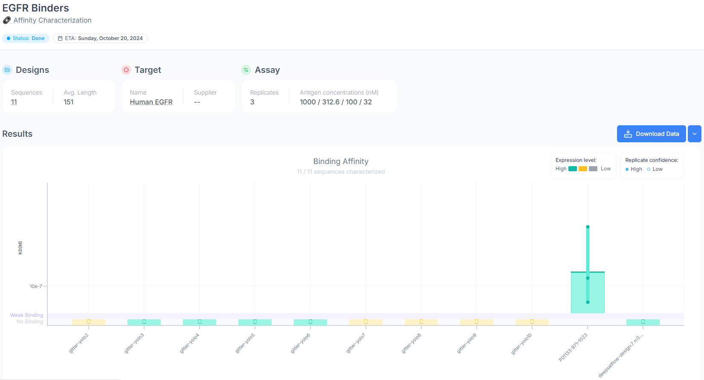

# Adaptyv Bio EGFR Protein Design Competition

Sequences and additional screening data from Adaptyv Bio's [EGFR Protein Design Competition](https://design.adaptyvbio.com/)

## Round 1 submission
`round1-egfr-inhibitors.fasta` contains the original 10 sequences I submitted to the competition.
They are described in this [thread](https://x.com/anthonygitter/status/1827760228122738689).
One of them, `gitter-yolo1`, ranked 21 by iPAE and was selected for testing.
It had low expression and did not bind EGFR in experimental testing.

The `round1/llama-egfr-inhibitor-chat.*` files are transcripts from the five Llama 3.1-405B designs.

## Round 1 second submission
I made a post-round 1 submission to Adaptyv for additional experimental screening that included 11 sequences (`round1-second-submission.fasta`):
- The 9 from `round1-egfr-inhibitors.fasta` that were not selected by Adaptyv during the competition (all except `gitter-yolo1`, simply `yolo1` here)
- Human EGF
- An additional sequence from [@deepsatflow](https://x.com/deepsatflow/status/1838608857372733659)

Human EGF was suggested by [@btnaughton](https://x.com/btnaughton/status/1838659396337099172) and seconded by [@gottapatchemall](https://x.com/gottapatchemall/status/1838678445725036671).
It was of interest because many of the top-scoring designs by [iPAE](https://design.adaptyvbio.com/), including `gitter-yolo1`, were based on EGF but did not bind EGFR.
The specific sequence proposed was a 53 amino acid sequence from [UniProt](https://www.uniprot.org/uniprotkb/P01133/entry#PRO_0000007541).
This was the same sequence I obtained from [PDB 8HGS](https://www.rcsb.org/sequence/8hgs) for my submission and confirmed in [Bai 2023](https://doi.org/10.1038/s41421-023-00523-5).

`deepsatflow-design:7 n:0|mpnn:1.320|plddt:0.922|i_ptm:0.893|i_pae:4.337|rmsd:1.423` was created using methods in a separate GitHub [repository](https://github.com/deepsatflow/adaptyv-bio-pdc).
Briefly, it is a ColabFold workflow that involves [RFdiffusion](https://doi.org/10.1038/s41586-023-06415-8), [ProteinMPNN](https://doi.org/10.1126/science.add2187), and [AlphaFold-Multimer](https://doi.org/10.1101/2021.10.04.463034).

None of the designed round 1 second submissions bound EGFR.
Only the positive control, human EGF, bound the target.
See `round1-second-submission-data.csv` for the data table and the `round1-second-submission-raw-data` subdirectory for the raw kinetic data.

The Adaptyv team noted that they ran this experiment at a higher starting concentration (1000 nM) compared to the competition.
Also, some of the sequences (e.g. `gitter-yolo3` and `gitter-yolo5`) exhibited aggregation.

## Round 2
The [`round2`](round2/) subdirectory contains the complete strategy, code, and submissions for round 2 of the competition.
`gitter.yolo23`, `gitter.yolo46`, and `gitter.yolo48` were selected for [experimental testing](https://foundry.adaptyvbio.com/egfr_design_competition_2)!

## Additional information
- Adaptyv Bio [results](https://foundry.adaptyvbio.com/egfr_design_competition)
- Adaptyv Bio [GitHub dataset](https://github.com/adaptyvbio/egfr_competition_1)
- Adaptyv Bio [round 1 competition lessons](https://adaptyvbio.substack.com/p/protein-optimization-102-lessons)
- The [BioLM](https://biolm.ai/) team submitted additional sequences after round 1 and [shared their analysis](https://x.com/NikhilHaas/status/1844446275967779284)
- [suzuki-2001](https://github.com/suzuki-2001)'s Adaptyv competition [repo](https://github.com/suzuki-2001/adaptyv-protein-comp)
